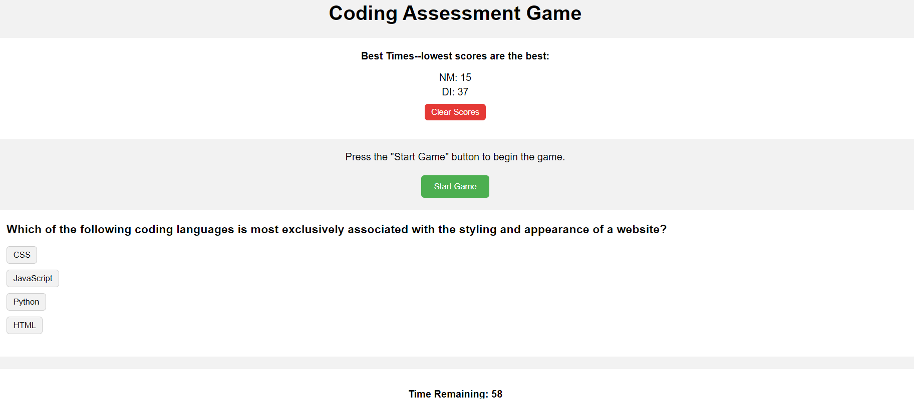

# coding-assessment
Challenge Description: Developers were tasked with creating a timed coding quiz that would utilize a combination of HTML, CSS, JavaScript, and Web-Based APIs in its utility. Acceptance criteria dictated that upon a button click, a timer would start and questions would render. Additionally, new questions were supposed to render after each answer with incorrect answers resulting in a time penalty, and correct answers resulting in no penalty. Additionally, when all questions have been answered or the timer reaches zero, the game should end, and the user should have the options to save their initials and their high score which should be rendered to the page.

Development Process: This developer created a relatively simple HTML framework in the site's body that mostly included spaces and containers for information to be rendered through JavaScript. CSS styling kept the application visually appealing without being overly distracting or unnecessarily detailed (which could have slown efficiency of the application's run). JavaScript did much of the heavy lifting in this regard, populating the HTML containers with new information throughout the application's run process. Much of the JavaScript was focused on establishing the variables that would be acted upon by the JS code, setting up the arrays of questions, answer groups, and answers to render one question at a time, and then a series of functions that performed basic tasks of starting and decrementing the timer, transitioning from one question to the next, shuffling answers for random rendering, and resetting the application upon the game's completion. Mastery of event listeners was a crucial skill as it affected the triggering of actions that would start the game, clear the high score list, select answers, and cue alerts that would update the user of current progress.

Link to deployed application: https://natejmaster.github.io/coding-assessment/

Screenshot of Deployed Application:
